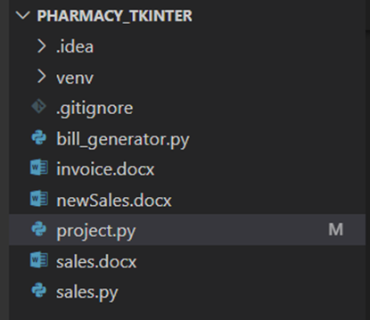
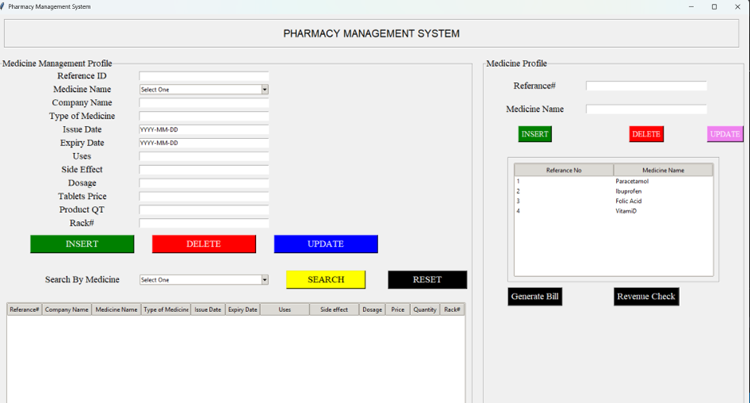
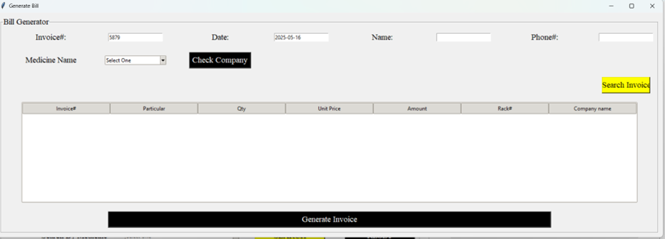
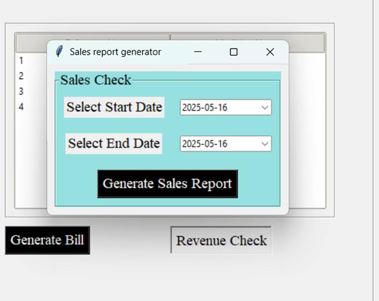

# 💊 Pharmacy Management System - Python Tkinter + MySQL

This project is a simple desktop-based **Pharmacy Management System** built using **Python Tkinter** for the graphical user interface (GUI) and **MySQL** for database management. It is intended for educational purposes or as a starter template for desktop CRUD applications.

---

## 🧰 Features

- Add, update, delete, and view medicine records
- Simple GUI with Tkinter
- Uses `mysql-connector-python` to connect to MySQL
- Works with XAMPP as the local MySQL server
- Compatible with database GUI tools like DBeaver
- can generate invoice/bill
- also can generate sales info

---

## 📦 Project Structure
 
 

## ⚙️ Setup Instructions

### 1. Clone the Repository

```bash
git clone https://github.com/your-username/pharmacy_tkinter.git
cd pharmacy_tkinter
Replace your-username with your actual GitHub username.

### 2. Install Required Python Packages
Make sure Python is installed, then run:
pip install mysql-connector-python
### 3. Start MySQL with XAMPP
Launch the XAMPP Control Panel
Click Start next to MySQL
Open http://localhost/phpmyadmin

### 4. Create the Database and Table
CREATE DATABASE pharmacy;
CREATE TABLE medicine(ref_id char(20) primary key, medname char(20))
CREATE TABLE stockList (ref_id char(20), compname char(20), medname char(20), typoMed char(20), issueDate DATE, expDate DATE,uses char(20), sideEff char(20), dos char(20), price decimal(10,2), qty char(20), rack char(20))

### 5. Run the Application
python project.py

## Screenshots
## Main UI



 
## View when clicked Generate Bill
 

## the UI when click on Revenue check 


🧠 Technologies Used
•	Python 3.11+
•	Tkinter
•	MySQL (with XAMPP)
•	DBeaver (optional for DB visualization)
•	mysql-connector-python
📝 License
•	This project is free to use and modify for non-commercial purposes. 
